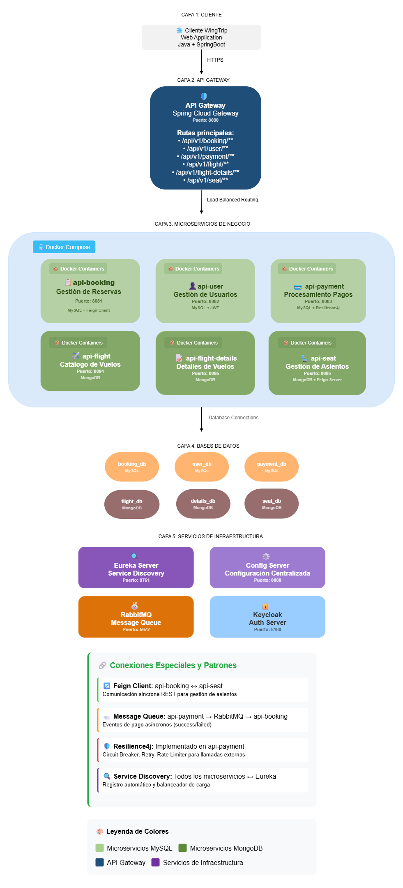
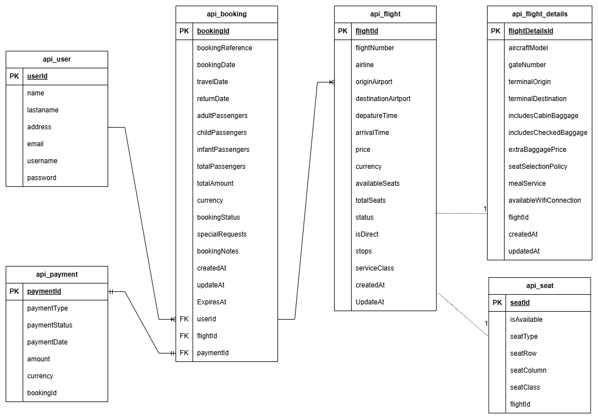

# WingTrip - Microservices Platform


🚀 **Plataforma de reservas de vuelos desarrollada con arquitectura de microservicios**


> Estado actual: **En desarrollo** - Proyecto de práctica y aprendizaje


## Descripción


WingTrip es una plataforma de reservas de vuelos construida con Spring Boot y arquitectura de microservicios. El proyecto implementa patrones modernos como Service Discovery, API Gateway, y está diseñado para escalar horizontalmente.


## Arquitectura General





### Stack Tecnológico


- **Framework:** Spring Boot 3.x + Spring Cloud

- **Base de Datos:** MySQL 8.0 + MongoDB (próximamente)

- **Service Discovery:** Netflix Eureka

- **API Gateway:** Spring Cloud Gateway

- **Containerización:** Docker + Docker Compose

- **Mensajería:** RabbitMQ (api-payment → api-booking)

- **Resiliencia:** Resilience4j (Circuit Breaker, Retry, Rate Limiter)

- **Trazabilidad:** Zipkin (api-payment)


### Comunicación entre Microservicios

- **Síncrona:** API REST + Feign Client (próximamente)

- **Asíncrona:** RabbitMQ (eventos de pago → actualización de reservas)


## Modelo de Datos





\*Nota: El DER será actualizado en v2.0 con la implementación de Keycloak (password → phoneNumber)\*


## Microservicios

### Fase 1 & 2 - Completadas

| Servicio | Puerto | BD | Tecnologías | Estado |
|----------|---------|-----|-------------|--------|
| **config-server** | 8888 | - | Spring Cloud Config | Funcionando  |
| **eureka-server** | 8761 | - | Netflix Eureka | Funcionando  |
| **api-gateway** | 8080 | - | Spring Cloud Gateway | Funcionando  |
| **api-user** | 8081 | MySQL | JPA + Swagger | Funcionando  |
| **api-booking** | 8082 | MySQL | JPA + RabbitMQ Consumer | Funcionando  |
| **api-payment** | 8083 | MySQL | Resilience4j + RabbitMQ Publisher | Funcionando  |

### Fase 3 - En desarrollo

| Servicio | Puerto | BD | Tecnologías | Estado |
|----------|---------|-----|-------------|--------|
| **api-flight** | 8084 | MongoDB | - | En desarrollo |
| **api-flight-details** | 8085 | MongoDB | - | Planeado |
| **api-seat** | 8086 | MongoDB | Feign Client | Planeado |


### Infraestructura Actual

| Servicio | Puerto | Uso | Estado |
|----------|---------|-----|--------|
| **MySQL User** | 3310 | Base de datos usuarios | Funcionando |
| **MySQL Booking** | 3311 | Base de datos reservas | Funcionando |
| **MySQL Payment** | 3312 | Base de datos pagos | Funcionando |
| **RabbitMQ** | 5672/15672 | Cola mensajería payment → booking | Funcionando |
| **Zipkin** | 9411 | Trazabilidad distribuida | Funcionando |

### Infraestructura Futura Planeada

| Servicio | Puerto | Uso | Estado |
|----------|---------|-----|--------|
| **MongoDB Flight** | 27017 | Catálogo vuelos | Planeado |
| **MongoDB Seats** | 27018 | Gestión asientos | Planeado |
| **MongoDB Details** | 27019 | Detalles vuelos | Planeado |
| **Keycloak** | 8180 | Autenticación | Planeado |

## Flujo de Negocio
```
Cliente → API Gateway → api-booking (crea reserva PENDING)
                     → api-payment (procesa pago)
                              ↓ RabbitMQ (payment.events)
                     api-booking (actualiza reserva a PAID)
```

## Quick Start

### Prerrequisitos

- Docker & Docker Compose

- Java 17+

- Maven 3.8+


### Instalación
```bash

# 1. Clonar repositorio

git clone <https://github.com/Erimtz/wingTrip.git>
cd wingtrip

# 2. Compilar microservicios
cd config-server && mvn clean package -DskipTests && cd ..
cd eureka-server && mvn clean package -DskipTests && cd ..
cd api-gateway && mvn clean package -DskipTests && cd ..
cd api-user && mvn clean package -DskipTests && cd ..
cd api-booking && mvn clean package -DskipTests && cd ..
cd api-payment && mvn clean package -DskipTests && cd ..

# 3. Configurar variables de entorno
cp .env.example .env
# Editar .env con tus configuraciones

# 4. Levantar toda la plataforma
docker-compose up --build

# 5. Verificar servicios
# Eureka: http://localhost:8761
# RabbitMQ: http://localhost:15672
# Zipkin: http://localhost:9411
```
### Orden de arranque

Los servicios se levantan automáticamente en este orden:

1. **Bases de datos** (mysql-user, mysql-booking, mysql-payment)
2. **Infraestructura** (config-server, eureka-server)
3. **Servicios externos** (zipkin, rabbitmq)
4. **Microservicios** (api-user, api-booking, api-payment)
5. **API Gateway**

### Variables de Entorno (.env)
```bash

DATABASE_ROOT_PASSWORD=rootpassword123
USER_DB_USER=wingtrip_user
USER_DB_PASS=1324
BOOKING_DB_USER=wingtrip_booking
BOOKING_DB_PASS=1324
PAYMENT_DB_USER=wingtrip_payment
PAYMENT_DB_PASS=1324
RABBITMQ_USERNAME=admin
RABBITMQ_PASSWORD=admin123
```

## API Documentation

### Swagger UI

| Microservicio | URL |
|---------------|-----|
| api-user | [localhost:8081/swagger-ui](http://localhost:8081/swagger-ui/index.html#/) |
| api-booking | [localhost:8082/swagger-ui](http://localhost:8082/swagger-ui/index.html#/) |
| api-payment | [localhost:8083/swagger-ui](http://localhost:8083/swagger-ui/index.html#/) |

### Endpoints Principales

| Endpoint | Método | Servicio | Descripción |
|----------|--------|----------|-------------|
| `/api/v1/user/**` | CRUD | api-user | Gestión de usuarios |
| `/api/v1/booking/**` | CRUD | api-booking | Gestión de reservas |
| `/api/v1/payment/create` | POST | api-payment | Crear pago |
| `/api/v1/payment/process/{id}` | PUT | api-payment | Procesar pago → dispara evento RabbitMQ |
| `/api/v1/payment/refund/{id}` | PUT | api-payment | Reembolsar pago |
| `/api/v1/payment/find/{id}` | GET | api-payment | Buscar pago |

### Postman Collections

Las colecciones de Postman están disponibles en cada microservicio:

- `api-user/postman/` - Colección de usuarios
- `api-booking/postman/` - Colección de reservas
- `api-payment/postman/` - Colección de pagos

## Testing & Quality

### Cobertura JaCoCo

| Microservicio | Cobertura | Tests | Framework |
|---------------|-----------|-------|-----------|
| **api-user** | 48% | ✅ | JUnit 5 + Mockito |
| **api-booking** | 67% |  34 tests | JUnit 5 + Mockito |
| **api-payment** | 96% |  42 tests | JUnit 5 + Mockito |

### Ejecutar tests
```bash

# Tests de un microservicio específico
cd api-payment
mvn clean test

# Ver reporte JaCoCo
# Abrir: target/site/jacoco/index.html
```

### Estrategia de Testing

- **Unit Tests:** JUnit 5 + Mockito por microservicio
- **Integration Tests:** Postman Collections
- **Load Testing:** Pendiente - con Zipkin tracing al final del proyecto

## 🌐 URLs de Desarrollo

### Servicios Core

| Servicio | URL |
|----------|-----|
| Eureka Dashboard | http://localhost:8761 |
| API Gateway | http://localhost:8080 |
| Gateway Health | http://localhost:8080/actuator/health |

### Microservicios

| Servicio | Swagger | Health |
|----------|---------|--------|
| api-user | http://localhost:8081/swagger-ui/index.html | http://localhost:8081/actuator/health |
| api-booking | http://localhost:8082/swagger-ui/index.html | http://localhost:8082/actuator/health |
| api-payment | http://localhost:8083/swagger-ui/index.html | http://localhost:8083/actuator/health |

### Infraestructura

| Servicio | URL |
|----------|-----|
| Zipkin UI | http://localhost:9411 |
| RabbitMQ Management | http://localhost:15672 |

### Bases de Datos

| Base de Datos | Puerto |
|---------------|--------|
| MySQL User DB | localhost:3310 |
| MySQL Booking DB | localhost:3311 |
| MySQL Payment DB | localhost:3312 |

## Estado del Proyecto

### ✅ Completado

- Arquitectura base de microservicios
- Service Discovery con Eureka
- API Gateway configurado
- Config Server centralizado
- api-user CRUD completo + tests
- api-booking CRUD completo + tests + RabbitMQ Consumer
- api-payment CRUD completo + tests + Resilience4j + RabbitMQ Publisher
- Cola de mensajería payment → booking funcionando
- Docker Compose para desarrollo
- Zipkin trazabilidad activa

### 🔄 En Desarrollo

- api-flight (MongoDB)

### Pendiente

- **api-flight-details** - Detalles de vuelos (MongoDB)
- **api-seat** - Gestión de asientos (MongoDB + Feign Client)
- **Feign Client** - Comunicación síncrona api-booking ↔ api-seat
- **Keycloak** - Autenticación centralizada
- **Load Testing** - Pruebas de carga con Zipkin al finalizar todos los servicios
- **CI/CD** - GitLab pipelines

## 🔄 Roadmap

### ✅ Fase 1 - Core Services
-  Infraestructura base (Eureka, Gateway, Config Server)
-  api-user - CRUD completo
-  api-booking - CRUD completo + RabbitMQ Consumer

### ✅ Fase 2 - Payment & Resilience
-  api-payment - CRUD completo
-  Resilience4j - Circuit Breaker, Retry, Rate Limiter
-  RabbitMQ - Cola de eventos payment → booking
-  Zipkin - Trazabilidad distribuida

### 🔄 Fase 3 - Flight Services
-  api-flight - Catálogo de vuelos (MongoDB)
-  api-flight-details - Detalles de vuelos (MongoDB)
-  api-seat - Gestión de asientos (MongoDB + Feign Client)
-  Feign Client - api-booking ↔ api-seat

### 📋 Fase 4 - Security & Production
-  Keycloak - Autenticación centralizada
-  Load Testing - Pruebas de carga con Zipkin
-  CI/CD - GitLab pipelines

## 🎯 Objetivos de Aprendizaje

-  **Microservicios:** Arquitectura distribuida
-  **Spring Cloud:** Eureka, Gateway, Config Server
-  **Docker:** Containerización y orquestación
-  **Resilience Patterns:** Circuit Breaker, Retry, Rate Limiter
-  **Message Queues:** RabbitMQ para comunicación asíncrona
-  **Distributed Tracing:** Zipkin para observabilidad
-  **Testing:** JUnit 5 + Mockito + JaCoCo
-  **NoSQL:** MongoDB para datos no relacionales
-  **Service Communication:** Feign Client para REST síncronas
-  **Load Testing:** Pruebas de estrés y performance
-  **Seguridad:** Keycloak para autenticación centralizada
-  **CI/CD:** GitLab para integración continua

## 🤝 Proyecto Personal

Este es un **proyecto personal de aprendizaje y práctica**. Desarrollado para experimentar con arquitecturas de microservicios y tecnologías modernas de Spring Boot.

### 🎯 Propósito

- Aprendizaje hands-on de microservicios

- Experimentación con patrones distribuidos

- Portfolio técnico personal

- Práctica de tecnologías enterprise

## 📞 Contacto

- **Desarrollador:** Erika Martínez

- **Email:** erimtz2@gmail.com

- **LinkedIn:** [linkedin.com/in/erika-daniela-martinez](https://linkedin.com/in/erika-daniela-martinez)

- **Proyecto:** Práctica de Microservicios con Spring Boot


## 📄 Licencia

Este proyecto es de código abierto para fines educativos - MIT License

---

⭐ **Si te gusta este proyecto, dale una estrella!** ⭐

🚀 **WingTrip - Volando hacia el futuro de los microservicios** 🚀

